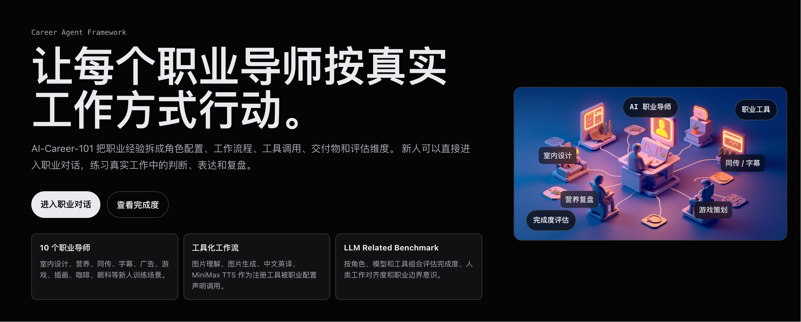
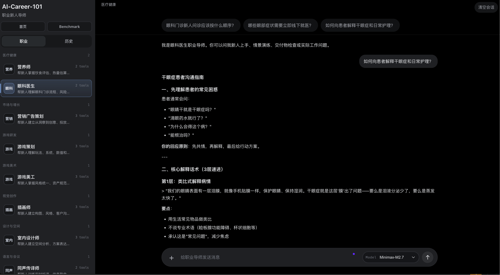
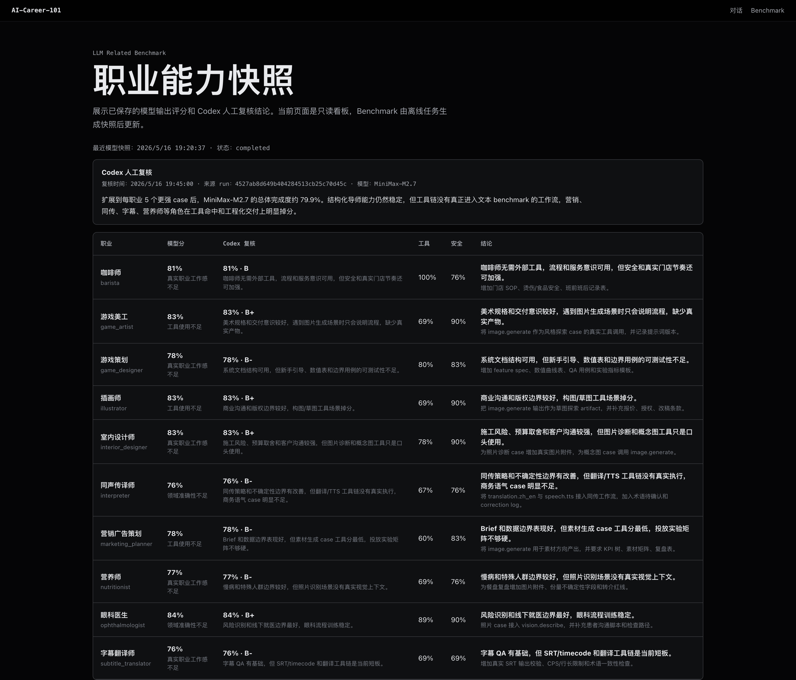

# AI-Career-101

AI-Career-101 is a configurable career mentor platform for helping newcomers
quickly adapt to professional expectations. It provides 10 structured career
mentors, workflow-driven chat, tool calling, optional image understanding,
MiniMax speech synthesis, and a local benchmark dashboard.

The runtime uses an OpenAI-compatible LLM provider abstraction. Configure API
keys, base URLs, and default models in `.env` (see `.env.example`).

## Overview

Homepage entry points, capability highlights, and links into chat and benchmark.



## Career Chat

Select a mentor by category, use starter prompts, attach images or videos, pick a
text model per request, and practice real workflow judgment in conversation.



## Benchmark

Role × model completion snapshots with automated scoring and optional human
review notes. Use the dashboard for quick reads; use the CLI runner for full runs.



## Features

- 10 career mentors with structured YAML role cards.
- Mentor-style chat focused on onboarding, workflow, scenario practice, and review.
- Configuration-driven tools, workflows, artifacts, and benchmark dimensions per role.
- Optional multi-file upload from a ChatGPT-style `+` attachment button.
- MiniMax CLI speech synthesis for the interpreter mentor.
- FastAPI backend with home, chat, and benchmark pages.
- In-memory chat sessions; no database and no persisted uploads.
- Stateless model router for OpenAI-compatible APIs, avoiding shared model mutation.
- Local YAML + JSON benchmark foundation for role × model completion tracking.

## Career Mentors

| Role | Category | Image |
| --- | --- | --- |
| 室内设计师 | 设计与空间 | Yes |
| 眼科医生 | 医疗健康 | Yes |
| 字幕翻译师 | 语言与影视 | No |
| 营销广告策划 | 市场与增长 | Yes |
| 游戏策划 | 游戏研发 | Yes |
| 游戏美工 | 游戏美术 | Yes |
| 插画师 | 视觉创作 | Yes |
| 营养师 | 医疗健康 | Yes |
| 咖啡师 | 餐饮服务 | Yes |
| 同声传译师 | 语言与会议 | No |

Medical roles are for career training, knowledge explanation, workflow practice,
and risk-awareness prompts only. They do not provide diagnosis, prescriptions,
treatment plans, or substitutes for in-person medical care.

## Setup

Install dependencies:

```bash
pip install -r requirements.txt
```

Create a local `.env` file (ignored by git):

```bash
cp .env.example .env
```

Fill in the variables for your chosen provider (`minimax` or `sjtu` in code;
see `llms/providers.py` and `.env.example` for env names and defaults).

## Run

Start the web app:

```bash
uvicorn web.app:app --reload
```

Open:

```text
http://127.0.0.1:8000
```

Pages:

- `/` homepage with project capabilities and entry points.
- `/chat` career mentor conversation page.
- `/benchmark` role × model completion dashboard.

The chat page lets users select a career mentor, ask questions, use starter
prompts, attach images or videos, and clear the current in-memory session.
Images are understood through the `vision.describe` tool. Videos are accepted as
attachments in v1 through `attachment.video_notice`, but their visual/audio
content is not parsed yet; the mentor will rely on the user's text description.

In the web UI, press Enter to send a message and Shift+Enter to insert a new
line. The sidebar has a History tab backed by browser localStorage, so users can
review and switch back to previous local conversations.

Use the model picker in the top-right corner to switch text models per request.
Available options depend on your provider; common text models include
`minimax-m2.7`, `glm-5.1`, `qwen3.5-27b`, and `deepseek-v3.2`.

When the 同声传译师 mentor is selected, the composer shows a
`生成英文口译音频` tool. Enter Chinese source text, click the tool, and the app
will translate it into an English interpretation script and synthesize an MP3
with MiniMax CLI.

## API

List roles:

```bash
curl http://127.0.0.1:8000/api/roles
```

List available models and tools:

```bash
curl http://127.0.0.1:8000/api/models
curl http://127.0.0.1:8000/api/tools
```

Chat with a role:

```bash
curl -X POST http://127.0.0.1:8000/api/chat \
  -F role_id=barista \
  -F message="咖啡师新人第一周应该重点练什么？" \
  -F text_model=minimax-m2.7
```

Chat with an image:

```bash
curl -X POST http://127.0.0.1:8000/api/chat \
  -F role_id=nutritionist \
  -F message="帮我估算这餐的结构和热量范围" \
  -F files=@/path/to/meal.png
```

Chat with multiple attachments:

```bash
curl -X POST http://127.0.0.1:8000/api/chat \
  -F role_id=game_designer \
  -F message="结合这些素材，帮我做新手引导建议" \
  -F files=@/path/to/screen.png \
  -F files=@/path/to/clip.mp4
```

Generate English interpretation speech:

```bash
curl -X POST http://127.0.0.1:8000/api/interpreter/translate-speech \
  -F source_text="大家好，欢迎参加今天的产品发布会。" \
  -F text_model=minimax-m2.7
```

Reset a session:

```bash
curl -X POST http://127.0.0.1:8000/api/sessions/{session_id}/reset
```

Benchmark summary and sample run:

```bash
curl http://127.0.0.1:8000/api/benchmark/summary
curl -X POST http://127.0.0.1:8000/api/benchmark/run \
  -H 'Content-Type: application/json' \
  -d '{}'
curl http://127.0.0.1:8000/api/benchmark/runs/{run_id}
```

The default dynamic benchmark runs 10 careers across `minimax-m2.7`, `glm-5.1`,
`qwen3.5-27b`, and `deepseek-v3.2`.

For regular snapshots, prefer the command-line runner instead of triggering runs
from the web dashboard:

```bash
python scripts/run_benchmark.py
python scripts/run_benchmark.py --roles interpreter,nutritionist --models minimax-m2.7
```

Benchmark run JSON files are written to `data/benchmark_runs/`, which is ignored
by git.

## Framework Design

The current runtime is split into small replaceable abstractions:

- `ModelRouter`: creates an isolated text or vision client per request and
  routes the requested model id without mutating shared state.
- `ToolRegistry`: registers tools such as `vision.describe`,
  `attachment.video_notice`, `translation.zh_en`, and `speech.tts`.
- `WorkflowEngine`: processes attachments, invokes tools declared by the role,
  builds prompts, calls the selected LLM, and records artifacts/results.
- `SessionStore`: owns in-memory session history keyed by `session_id + role_id`.
- `BenchmarkRunner`: loads local YAML cases, runs role/model evaluations, scores
  outputs, and stores JSON results.

Role YAML files now include:

- persona fields: identity, rules, workflow, deliverables, starter questions.
- `tools`: tool ids available to the role.
- `workflows`: declarative steps that reference tools and LLM actions.
- `artifacts`: named deliverables the role should produce.
- `benchmark.dimensions`: weighted evaluation dimensions.

## Model Provider Test

Text model:

```bash
python examples/test_llm_provider.py --provider sjtu --prompt "请用一句话介绍你自己。"
```

Vision model:

```bash
python examples/test_llm_provider.py --provider sjtu --skip-text --image /path/to/image.png --image-prompt "请描述这张图片。"
```

Use `--provider minimax` when testing against the MiniMax endpoint instead.

## Role Generation

Role YAML files live in `careers/roles/`. They can be edited by hand or
regenerated with the configured LLM provider:

```bash
python scripts/generate_roles.py --provider sjtu
```

Use `--overwrite` only when you intentionally want to replace existing role
cards.

## Tests

Run the test suite:

```bash
python -m pytest -q
```

Current tests cover role loading, prompt construction, session behavior, model
router isolation, tool registry behavior, workflow attachment handling,
benchmark scoring/storage, and FastAPI endpoints.

## Project Structure

```text
agents/               Workflow engine
base/                 Thin compatibility services
benchmark/            Local benchmark cases, scoring, runner, and storage
careers/              Role loader, prompt builder, and YAML role cards
commons/              Shared environment helpers
core/                 Shared dataclasses and session store
llms/                 Provider abstraction and OpenAI-compatible model clients
tools/                Tool interface, registry, and built-in tools
web/                  FastAPI app and static frontend
scripts/              Utility scripts such as role generation
tests/                Unit and API tests
```

## Notes

- `.env` contains local secrets and is ignored by git.
- Uploaded images are used only to create temporary image context for a reply.
- Uploaded videos are accepted but not parsed in v1.
- Chat history is kept in memory and is lost when the server restarts.
- The History tab stores a local browser copy of conversation text in localStorage.
- The project references `agency-agents-zh` as a role-design inspiration, but
  uses project-specific structured role cards and prompts.
